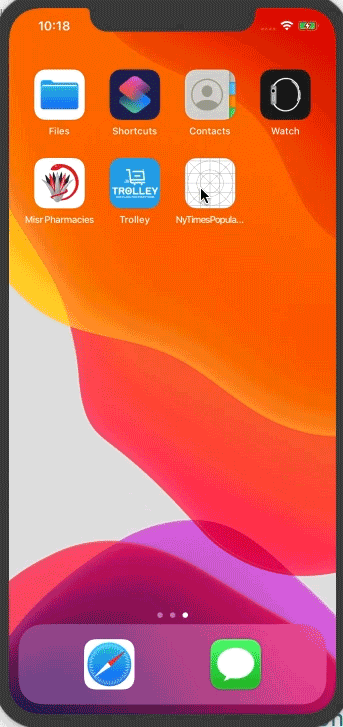

iOS App for showing list of articles published in nyTimes
Developed using xcode 11.1 swift 
used mvvm-c as design pattern 
network layer seperated in different framework
### How do I get up and running ? ###
 1- open terminal  
 2- go to the place you want to clone repository ex: type cd Downloads/  
 3- type git clone https://github.com/ahmednour25689/iOSArticlesApp.git  
 4- after clone type cd iOSArticlesApp  
 5- type  cd NyTimesPopularArticles  
 6- type pod install  
 7- after finish installing pods go the project folder   
 8- open  NyTimesPopularArticles folder  
 9- click on NyTimesPopularArticles.xcworkspace file  
 10 - run app from xcode  
 11- to run tests just choose product menu from xcode then test  
 
 
### Screens ###

